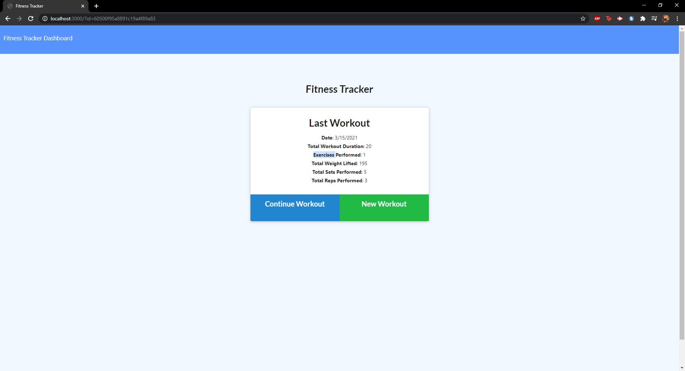
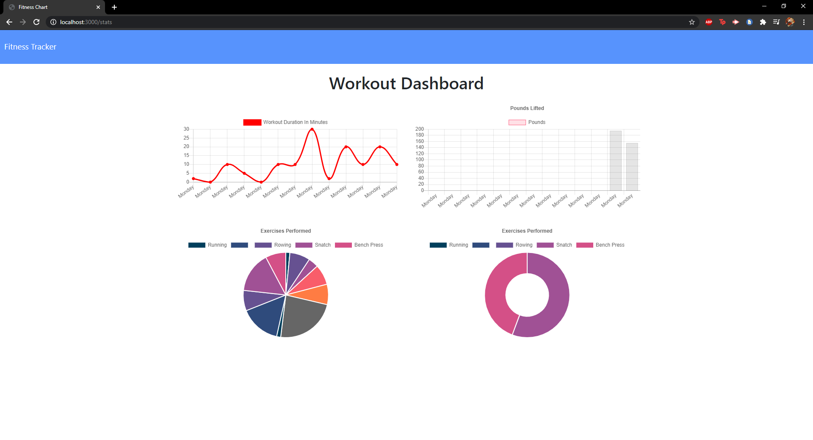

# FitnessTR

## Table of Contents

1. [About](#about)
1. [Pictures of Application](#pictures-of-application)
1. [Live Application](#live-application)
1. [Getting Started](#getting-started)
1. [License](#license)

---------------------------	

## About
FitnessTR is application that tracks your workout information. The user can add in any workout under two different categories:
resistance or cardio. The application allows the user to add any
workout movement to the database. It will log the information on a stats page. The stats store the data given and puts into graphs that show progress or decline. 

---------------------------

## Live Application

You can find the live application here: 

https://dashboard.heroku.com/apps/warm-headland-41371

---------------------------

## Pictures of Application

---------------------------	

## Getting Started 
Before you start, you must install a few things:
* mongoDB 
* Mongoose
* mongo Atlas
* Express
* Logger

---------------------------	

## License

MIT License

Copyright (c) 2021 Evan Chu

Permission is hereby granted, free of charge, to any person obtaining a copy
of this software and associated documentation files (the "Software"), to deal
in the Software without restriction, including without limitation the rights
to use, copy, modify, merge, publish, distribute, sublicense, and/or sell
copies of the Software, and to permit persons to whom the Software is
furnished to do so, subject to the following conditions:

The above copyright notice and this permission notice shall be included in all
copies or substantial portions of the Software.

THE SOFTWARE IS PROVIDED "AS IS", WITHOUT WARRANTY OF ANY KIND, EXPRESS OR
IMPLIED, INCLUDING BUT NOT LIMITED TO THE WARRANTIES OF MERCHANTABILITY,
FITNESS FOR A PARTICULAR PURPOSE AND NONINFRINGEMENT. IN NO EVENT SHALL THE
AUTHORS OR COPYRIGHT HOLDERS BE LIABLE FOR ANY CLAIM, DAMAGES OR OTHER
LIABILITY, WHETHER IN AN ACTION OF CONTRACT, TORT OR OTHERWISE, ARISING FROM,
OUT OF OR IN CONNECTION WITH THE SOFTWARE OR THE USE OR OTHER DEALINGS IN THE
SOFTWARE.

---------------------------	